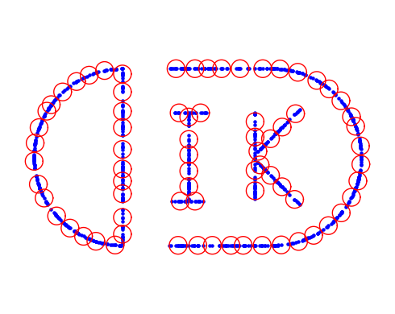

# MinimalFiniteCovering
This repository implements the minimal finite covering problem and its application, and is the official source code for paper "[Is Adversarial Training with Compressed Datasets Effective?](https://arxiv.org/abs/2402.05675)" (Chen & Selvan. 2024). For more information, contact: Tong Chen (toch@di.ku.dk).



## Requirements
torch, numpy, scipy, gurobipy (license is required)

## Basic Usage
Finite covering with fixed number $k$ and minimum radius $\eta$.
```
sub_data, eta, sol = FC(data).gen_data(A, k=k, save=False)
```

Finite covering with fixed radius $\eta$ and minimum number $k$.
```
sub_data, eta, sol = FC(data).gen_data(A, eta=eta, save=False)
```
